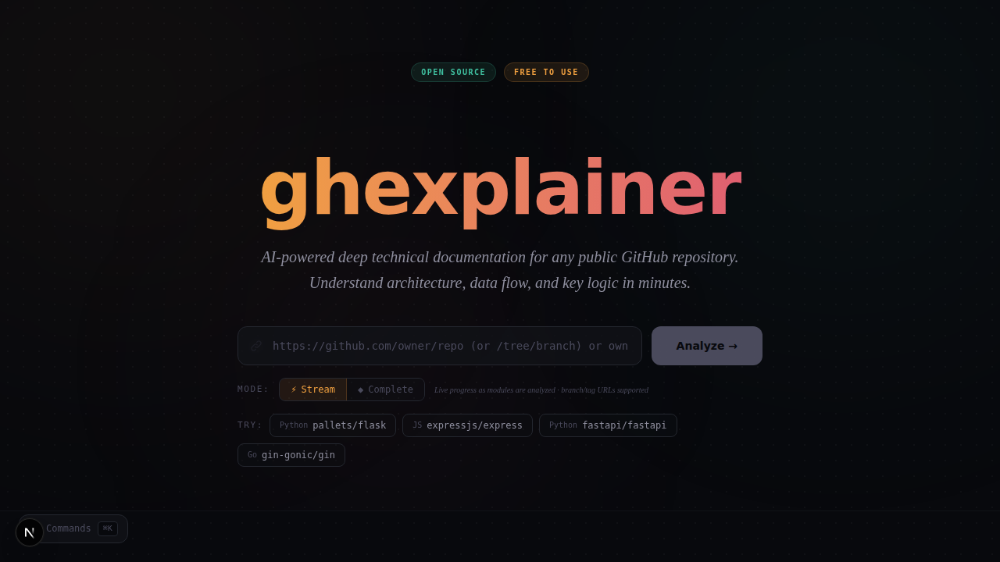

# 🔍 ghexplainer

**AI-powered deep technical documentation for any public GitHub repository.**

Paste a GitHub URL → get a structured 11-section analysis covering architecture, data flow, key algorithms, security, performance, and interview prep notes — all generated by Google Gemini.

---

## ✨ Features

- **11-Section Deep Analysis** — Repository Overview, Architecture, Key Components, Data Flow, Algorithms, Config, Error Handling, Testing, Performance, Security, Interview Notes
- **Smart Code Chunking** — Large repos are split into logical modules with dependency-aware grouping
- **Multi-Pass AI** — Per-module analysis → cross-module reasoning → unified synthesis
- **Markdown Output** — Clean `.md` files ready for docs, notes, or portfolio
- **JSON & HTML Export** — Export the full analysis as structured JSON (for CI/CD pipelines) or standalone HTML
- **Section Filtering** — Use `--section <n>` in the CLI to extract any of the 11 sections individually
- **Web UI + CLI** — Use the browser interface or the command line
- **Branch/Tag-Aware URLs** — Analyze `.../tree/<branch>` links and `?ref=<branch|tag>` targets directly
- **In-Memory Caching** — Repeated analyses are instant (1hr TTL)
- **Fresh Re-Run Control** — Skip cache from Web UI or CLI when you need up-to-date output
- **Rate Limit Protection** — 3-model fallback chain with exponential backoff

## 🚀 Quick Start

### Prerequisites

- [Node.js](https://nodejs.org/) 18+
- A [Google Gemini API key](https://aistudio.google.com/apikey) (free tier works)

### Setup

```bash
git clone https://github.com/meet1785/ghexplainer.git
cd ghexplainer
npm install

# Create your env file
cp .env.local.example .env.local
# Edit .env.local and add your GEMINI_API_KEY
```

### Web UI

```bash
npm run dev
# Open http://localhost:3000
```

### CLI

```bash
# Print analysis to stdout
npm run cli -- https://github.com/pallets/flask

# Owner/repo shorthand also works
npm run cli -- pallets/flask

# Save to file
npm run cli -- https://github.com/pallets/flask -o flask-analysis.md

# Force a fresh run (skip cache)
npm run cli -- https://github.com/pallets/flask --no-cache

# Export as structured JSON (useful for CI/CD pipelines)
npm run cli -- pallets/flask --format json -o flask-analysis.json

# Export as standalone HTML report
npm run cli -- pallets/flask --format html -o flask-report.html

# Print only section 4 (Core Execution Flow)
npm run cli -- pallets/flask --section 4

# Print section 1 as JSON
npm run cli -- pallets/flask --section 1 --format json
```

### Branch/Tag URL Support

Analyze non-default branches/tags directly with links like:

- `https://github.com/owner/repo/tree/develop`
- `https://github.com/owner/repo/blob/release-1.2.0/src/index.ts`
- `https://github.com/owner/repo?ref=feature/my-branch`



### Fresh Re-Run (Skip Cache)

When you need a guaranteed fresh analysis, enable **Fresh run (skip cache)** in the UI or pass `--no-cache` in CLI mode.


## 🏗️ Architecture

```
User Input (URL)
    │
    ▼
┌──────────────────────┐
│  GitHub REST API      │  Fetch repo metadata, file tree, source code
└──────────┬───────────┘
           ▼
┌──────────────────────┐
│  Smart Chunker        │  Group files by module, limit tokens, map dependencies
└──────────┬───────────┘
           ▼
┌──────────────────────┐
│  Multi-Pass Gemini    │  Chunk analysis → Cross-module reasoning → Synthesis
└──────────┬───────────┘
           ▼
┌──────────────────────┐
│  Documentation        │  Structured 11-section Markdown report
└──────────────────────┘
```

## 📂 Project Structure

```
ghexplainer/
├── app/
│   ├── api/analyze/route.ts   # POST /api/analyze endpoint
│   ├── page.tsx               # Main web UI
│   ├── layout.tsx             # Root layout + metadata
│   └── globals.css            # Tailwind + custom styles
├── components/
│   ├── RepoForm.tsx           # URL input with example repos
│   ├── LoadingState.tsx       # Step-by-step progress animation
│   └── AnalysisOutput.tsx     # Rendered markdown + download
├── lib/
│   ├── github.ts              # GitHub REST API client
│   ├── chunker.ts             # Smart code chunking engine
│   ├── gemini.ts              # Multi-pass Gemini analysis
│   ├── analyzer.ts            # Pipeline orchestrator
│   ├── cache.ts               # In-memory LRU cache
│   └── export.ts              # HTML export (optional)
├── cli/
│   └── index.ts               # CLI interface (commander)
└── package.json
```

## ⚙️ Configuration

| Variable | Required | Description |
|----------|----------|-------------|
| `GEMINI_API_KEY` | ✅ | Google Gemini API key ([get one free](https://aistudio.google.com/apikey)) |
| `GITHUB_TOKEN` | ❌ | GitHub PAT — increases rate limit from 60→5000 req/hr |

## 📄 CLI Options

```
Usage: ghexplainer <url> [options]

Arguments:
  url                    GitHub repository URL

Options:
  -o, --output <file>    Save output to a file
  --github-token <token> GitHub personal access token
  --gemini-key <key>     Gemini API key (overrides env)
  --no-cache             Skip cache and force fresh analysis
  --section <number>     Print only a specific section (1-11)
  --format <format>      Output format: markdown (default), json, html
  -V, --version          Output version number
  -h, --help             Display help
```

## 🛠️ Tech Stack

- **Framework**: Next.js 16 (App Router)
- **Language**: TypeScript
- **Styling**: Tailwind CSS v4
- **AI**: Google Gemini (gemini-2.5-flash / gemini-2.5-flash-lite)
- **Markdown**: react-markdown + remark-gfm
- **CLI**: Commander + tsx

## 📝 License

MIT
